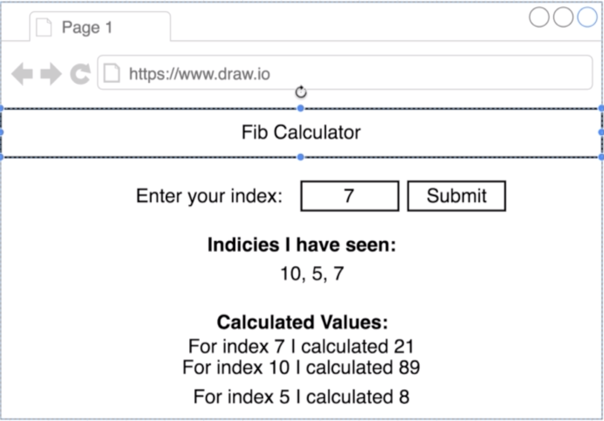
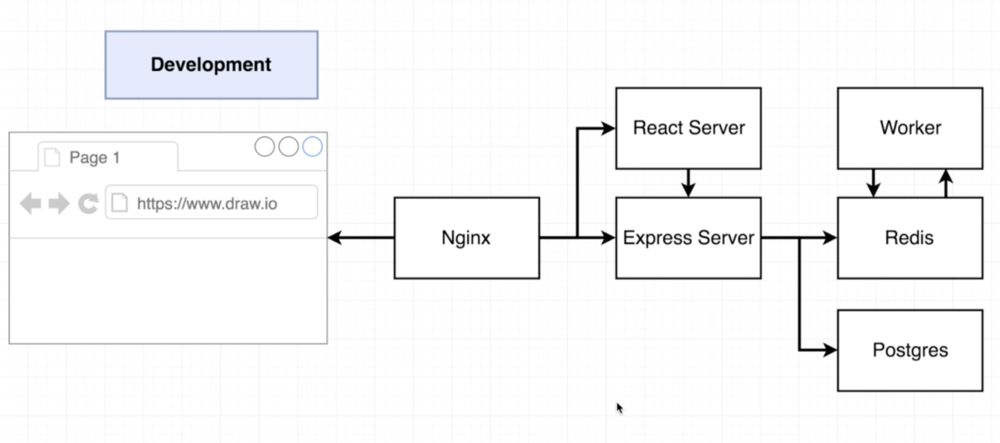
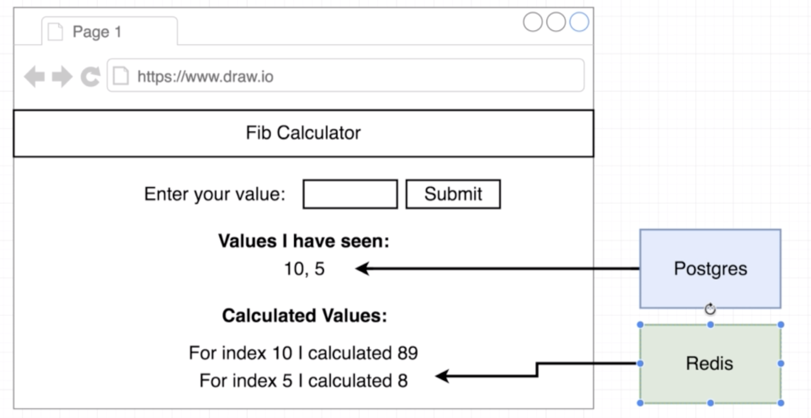
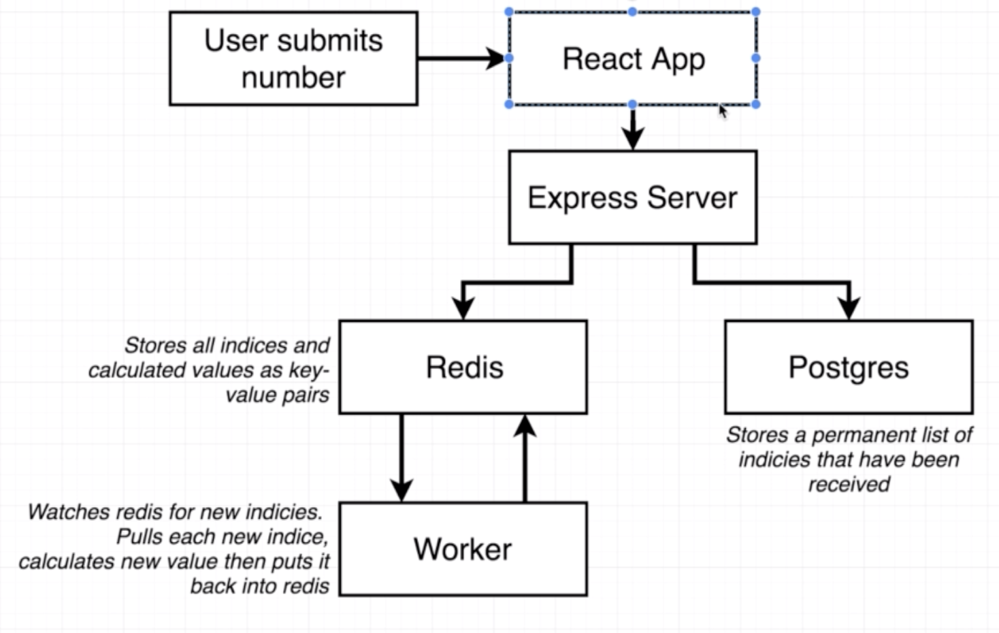
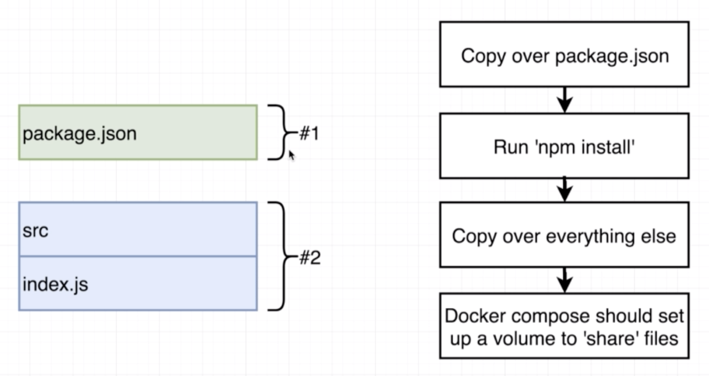
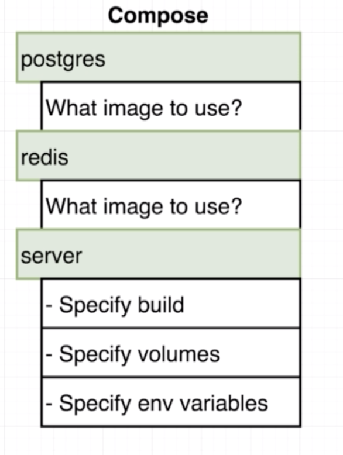
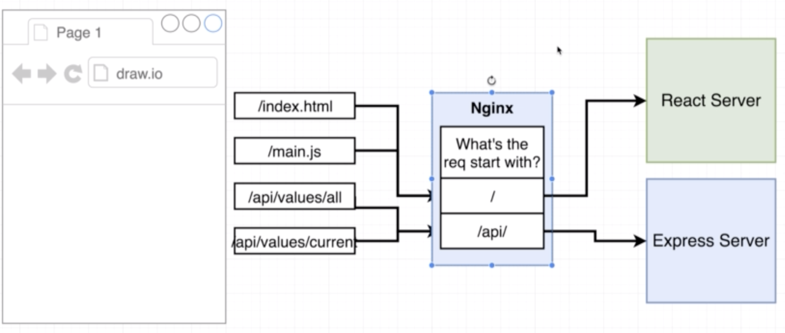
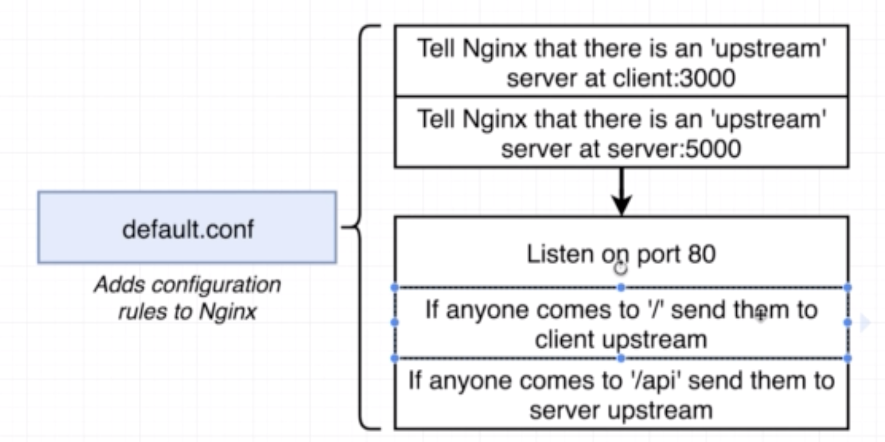

## Overview
### Final Result


### App Architecture


- When user boots up browser the request visits Nginx server
- Nginx does routing - decides whether to get front-end assets or trying to reach the backend, in which case request is routed to express server

The app uses two databases (increased complexity because this is a project to demonstrate multi-container deployments)



Behind the scenes, this is how a request is processed:


- User submits a number into the app through the web interface
- React App makes a (ajax) request to the express server
- The express server stores the request in the Postgres DB
- The epxress server also stores the number in the Redis DB
- If a new number shows up in the Redis DB, it wakes up the worker
- The worker processes the new index and returns the corresponding Fib number
- Else the Redis DB just returns the Fib value for already seen index

## Project Structure
```
├── README.md
├── client
│   ├── README.md
│   ├── package-lock.json
│   ├── package.json
│   ├── public
│   │   ├── favicon.ico
│   │   ├── index.html
│   │   └── manifest.json
│   └── src
│       ├── App.css
│       ├── App.js
│       ├── App.test.js
│       ├── Fib.js
│       ├── OtherPage.js
│       ├── index.css
│       ├── index.js
│       ├── logo.svg
│       └── registerServiceWorker.js
├── files.zip
├── readme_images
│   ├── app.png
│   ├── app2.png
│   ├── arch.png
│   └── db.png
├── server
│   ├── index.js
│   ├── keys.js
│   └── package.json
└── worker
    ├── index.js
    ├── keys.js
    └── package.json
```

## Dockerizing App
### Overall Plan


For client:

```
FROM node:alpine
WORKDIR '/app'
COPY ./package.json ./
RUN npm install
COPY . .
CMD ["npm","run","start"]
```

For worker and server:

```
FROM node:alpine
WORKDIR '/app'
COPY ./package.json ./
RUN npm install
COPY . .
CMD ["npm","run","dev"]
```

### Docker Compose and 'networking' between containers


`docker-compose.yml`

```
version: '3'
services:
  postgres:
    image: 'postgres:latest'
  redis:
    image: 'redis:latest'
  api:
    build: 
      dockerfile: Dockerfile.dev
      context: ./server
    volumes:
      - /app/node_modules
      - ./server:/app
    environment:
      - REDIS_HOST=redis
      - REDIS_PORT=6379
      - PGUSER=postgres 
      - PGHOST=postgres 
      - PGDATABASE=postgres 
      - PGPASSWORD=postgres_password 
      - PGPOR=5432  
  client_api:
    build:
      dockerfile: Dockerfile.dev
      context: ./client
    volumes:
      - /app/node_modules
      - ./client:/app
  worker:
    build:
      dockerfile: Dockerfile.dev
      context: ./worker
    volumes:
      - /app/node_modules
      - ./worker:/app
  nginx:
    restart: always
    depends_on:
      - api
      - client_api
    build: 
      dockerfile: Dockerfile.dev
      context: ./nginx
    ports:
        - '3050:80'
```

### Nginx Path Routing


### default.conf file for Nginx


```
upstream client_api {
	server client_api:3000;
}

upstream api {
	server api:5000;
}

server {
	listen 80;

	location / {
		proxy_pass http://client_api;
	}

	location /api {
		rewrite /api/(.*) /$1 break;
		proxy_pass http://api;
	}
}
```

### Building a custom Nginx docker image

`Dockerfile.dev`

```
FROM nginx
COPY ./default.conf /etc/nginx/conf.d/default.conf
```


## 
